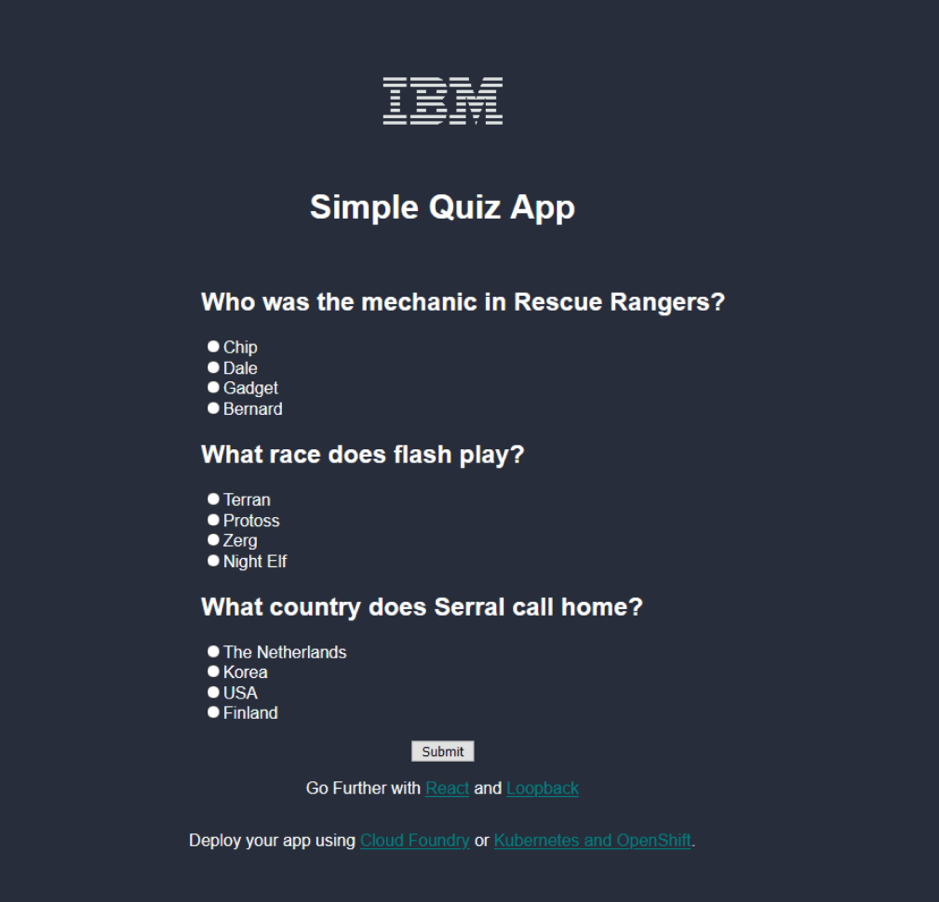
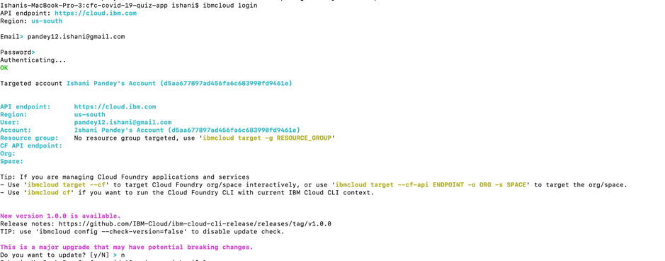
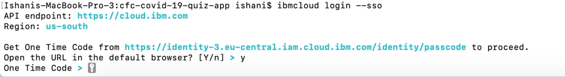
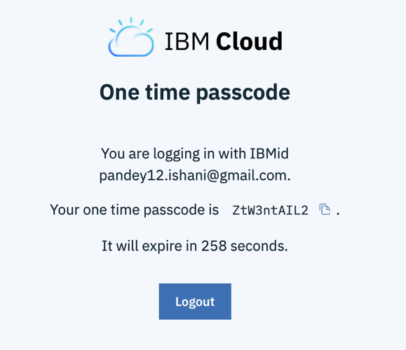
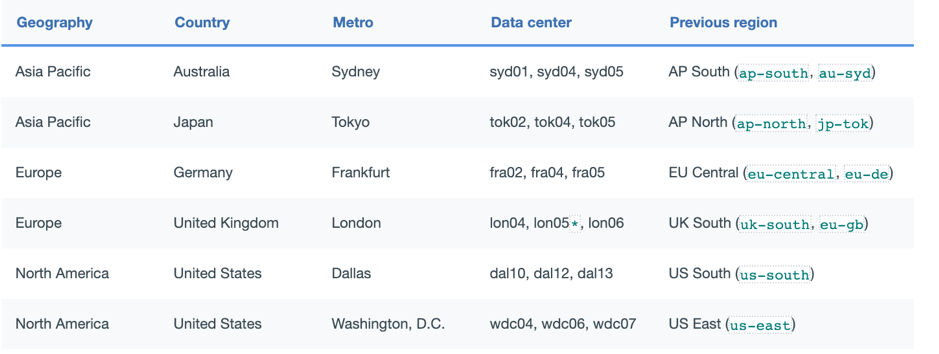
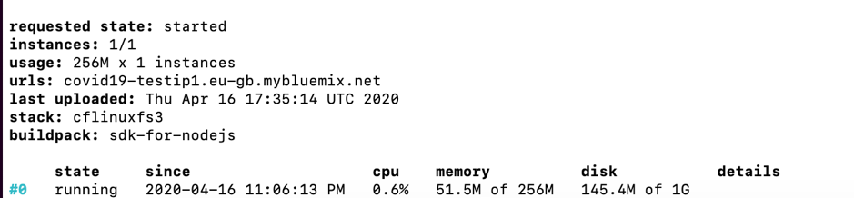
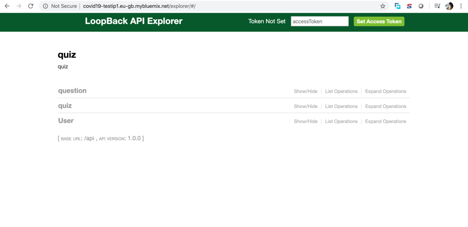
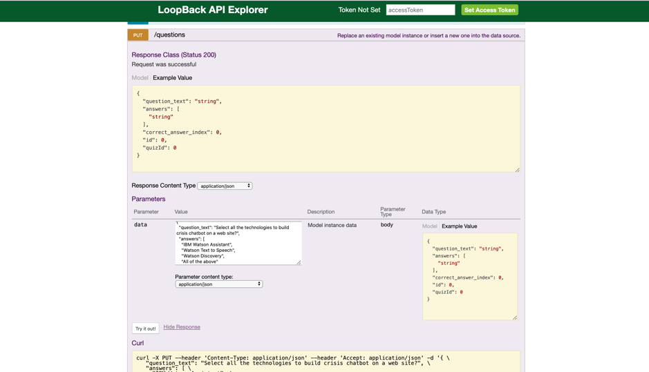

# Call for Code 2020 - Quiz App Starter Kit

This is a very simple example quiz application that uses a Loopback generated express app with a react frontend.

As more and more learning and collaboration moves online, developers will start to build microservices for distance learning. In this case a simple quiz app. The starter kit could easily be remixed into a short essay app, a grading app, or other education tool. Loopback is an open source tool for quickly building a data api for your applications. Whatever your specific application does, using loopback gets you quickly writing application logic and not writing data handling code.



## Learning objectives

By completing this tutorial, you will learn how to create a simple example quiz application that uses a Loopback-generated Express app with a React front end.

## Estimated time

Completing this tutorial should take about 30 minutes

## Architecture diagram


## Getting started

The core of this example is *generated code* from the Loopback utility. For clarity, we're using the now-deprecated version 3.0 of the library. This just makes it even easier to start, consider upgrading to Loopback v4 to get the latest features and security updates.

## Deployment on IBM Cloud

As this is a standard express application, you can use either Cloud Foundry or Kubernetes to host your application.

To deploy using cloud foundry, follow below mentioned steps to build your application and get it deployed on IBM Cloud.

#### Steps to follow-

Clone the above repository .

1)Login using
```
ibmcloud login
```
The output should be like below-


2)
```
ibmcloud login –sso
```


One time passcode will be generated-


3) Target to the Default resource group-
```
ibmcloud target -g Default
```
Output : Targeted resource group Default

4) Switch to the region which is mentioned in your IBM Cloud portal. Go to Manage->Account -> Cloud Foundry Orgs
Click on the Org provided for your account.
You should be landed to a page, displaying the space associated with the org.
The region should be mentioned there .

Pick that region and get the id for it from below chart-



5)Now target your organization and space

For example-
```
ibmcloud target -o Org1ishani -s dev
```

6) Go to the cloned repository and execute below step-
```
ibmcloud cf push -f deployment/quizapp-deployment.yaml covid19-testing
```
Edit the name of your application according "covid19-testing..."

7) Once the deployment in dcompleted, the user should be able to view below output at the end-



The application should be build and started , displaying the url for your application .
8) When the API is up, navigate to the Swagger API explorer at https://url/explorer.



9) Now create a quiz using this JSON blob:
```json
{
  "question_text": "Select all the technologies to build crisis chatbot on a web site?",
  "answers": [
    "IBM Watson Assistant",
    "Watson Text to Speech",
    "Watson Discovery",
    "All of the above"
  ],
  "correct_answer_index": 3,
  "quizId": 1
}
```


10) To be able to see the Quiz app ,access : https://url/index.html

NOTE:
View the application deployed from IBM cloud
1) Login to IBM Cloud https://cloud.ibm.com
2) Go to the top left hamburger sign and expland it
3) Click on Resource List
4) Click on the Cloud Foundry app just created.
5) The user should be landed to the application created with a  Visit App URL link beside it.
